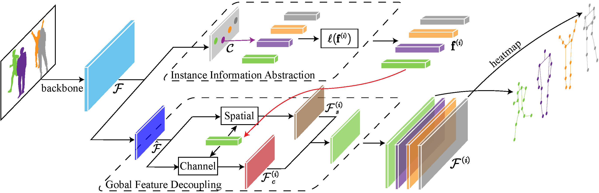

# Contextual Instance Decoupling for Robust Multi-Person Pose Estimation

[[`Paper`](https://openaccess.thecvf.com/content/CVPR2022/papers/Wang_Contextual_Instance_Decoupling_for_Robust_Multi-Person_Pose_Estimation_CVPR_2022_paper.pdf)]

> [Contextual Instance Decoupling for Robust Multi-Person Pose Estimation](https://openaccess.thecvf.com/content/CVPR2022/html/Wang_Contextual_Instance_Decoupling_for_Robust_Multi-Person_Pose_Estimation_CVPR_2022_paper.html)  
> Dongkai Wang, Shiliang Zhang  
> CVPR 2022 Oral  



## Installation

### 1. Clone code
```shell
    git clone https://github.com/kennethwdk/CID
    cd ./CID
```
### 2. Create a conda environment for this repo
```shell
    conda create -n CID python=3.9
    conda activate CID
```
### 3. Install PyTorch >= 1.6.0 following official instruction, *e.g.*,
```shell
    conda install pytorch torchvision torchaudio cudatoolkit=11.3 -c pytorch
```
There is no requirement for cudatoolkit version for CID, so just use the newest version.
### 4. Install other dependency python packages
```shell
    pip install -r requirements.txt
```
### 5. Prepare dataset
Download [COCO ](https://cocodataset.org/#home), [CrowdPose](https://github.com/Jeff-sjtu/CrowdPose) and [OCHuman](https://github.com/liruilong940607/OCHumanApi) from website and put the zip file under the directory following below structure, (xxx.json) denotes their original name.

```
./data
|── coco
│   └── annotations
|   |   └──coco_train.json(person_keypoints_train2017.json)
|   |   └──coco_val.json(person_keypoints_val2017.json)
|   |   └──coco_test.json(image_info_test-dev2017.json)
|   └── images
|   |   └──train2017
|   |   |   └──000000000009.jpg
|   |   └──val2017
|   |   |   └──000000000139.jpg
|   |   └──test2017
|   |   |   └──000000000001.jpg
├── crowdpose
│   └── annotations
|   |   └──crowdpose_trainval.json(refer to DEKR, link:https://github.com/HRNet/DEKR)
|   |   └──crowdpose_test.json
|   └── images
|   |   └──100000.jpg
├── ochuman
│   └── annotations
|   |   └──ochuman_val.json(ochuman_coco_format_val_range_0.00_1.00.json)
|   |   └──ochuman_test.json(ochuman_coco_format_test_range_0.00_1.00.json)
|   └── images
|   |   └──000001.jpg
```
## Usage

### 1. Download trained model
* [COCO](https://1drv.ms/u/s!AhpKYLhXKpH7gv8RepyMU_iU5uhxhg?e=ygs4Me)
* [CrowdPose](https://1drv.ms/u/s!AhpKYLhXKpH7gv8RepyMU_iU5uhxhg?e=ygs4Me)
* [OCHuman](https://1drv.ms/u/s!AhpKYLhXKpH7gv8RepyMU_iU5uhxhg?e=ygs4Me)
* [ImageNet pre-trained](https://1drv.ms/u/s!AhpKYLhXKpH7gv8RepyMU_iU5uhxhg?e=ygs4Me)

### 2. Evaluate Model
Change the checkpoint path by modifying `TEST.MODEL_FILE` option in *.yaml* or command line. 

`--gpus` option specifies the gpu ids for evaluation, multiple ids denotes multiple gpu evaluation.

```python
# evaluate on coco val set with 2 gpus
python tools/valid.py --cfg experiments/coco.yaml --gpus 0,1 TEST.MODEL_FILE model/coco/checkpoint.pth.tar

# evaluate on coco test-dev set with 2 gpus (submit to codalab)
python tools/infer_coco_testdev.py --cfg experiments/coco.yaml --gpus 0,1 TEST.MODEL_FILE model/coco/checkpoint.pth.tar

# evaluate on crowdpose test set with 2 gpus
python tools/valid.py --cfg experiments/crowdpose.yaml --gpus 0,1 TEST.MODEL_FILE model/crowdpose/checkpoint.pth.tar

# evaluate on ochuman test set with 2 gpus (trained on ochuman val set)
python tools/valid.py --cfg experiments/ochuman_val.yaml --gpus 0,1 TEST.MODEL_FILE model/ochuman/checkpoint.pth.tar

# evaluate on ochuman test set with 2 gpus (trained on coco train set)
python tools/valid.py --cfg experiments/ochuman_coco.yaml --gpus 0,1 TEST.MODEL_FILE model/coco/checkpoint.pth.tar

# evaluate on ochuman val set with 2 gpus (trained on coco train set)
python tools/valid.py --cfg experiments/ochuman_coco.yaml --gpus 0,1 TEST.MODEL_FILE model/coco/checkpoint.pth.tar DATASET.TEST val
```

### 3. Train Model

You need to download HRNet-W32 imagenet pretrained model (see above) and change the checkpoint path by modifying `MODEL.PRETRAINED` in .yaml, and run following commands:
```python
# train on coco with 2 gpus
python tools/train.py --cfg experiments/coco.yaml --gpus 0,1

# train on crowdpose with 2 gpus
python tools/train.py --cfg experiments/crowdpose.yaml --gpus 0,1

# train on ochuman with 2 gpus
python tools/train.py --cfg experiments/ochuman_val.yaml --gpus 0,1
```

The experimental results are obtained by training on two NVIDIA RTX 3090. You can use more gpu cards for model training by specifying gpu ids in `--gpus` optition, *e.g.*, training model on crowdpose on 8 gpu cards by
```python
# train on coco with 8 gpus
python tools/train.py --cfg experiments/coco.yaml --gpus 0,1,2,3,4,5,6,7
```

Note that you should modify corresponding batch size for each gpu by `TRAIN.IMAGES_PER_GPU`.

## Main Results
With the code contained in this repo, you should be able to reproduce the following results. 
### Results on COCO val and test-dev set
| Method| Test set | Backbone | Input size |     AP | AP.5 | AP .75 | AP (M) | AP (L) |
|----------|----------|----------|------------|-------|-------|--------|--------|--------| 
| CID| COCO val | HRNet-W32  | 512         | 69.8  | 88.5  |  76.6  |  64.0  |  78.9  | 
| CID| COCO test-dev | HRNet-W32  | 512         | 69.1  | 89.9  |  76.3  |  63.4  |  77.6  |     

### Results on CrowdPose test set
| Method| Backbone | Input size |     AP | AP .5 | AP .75 | AP (E) | AP (M) | AP (H) |
|----------|----------|------------|-------|-------|--------|--------|--------| --------| 
| CID| HRNet-W32  | 512         | 71.2  | 89.8  |  76.7  | 77.9  |  71.9  | 63.8  | 

### Results on OCHuman dataset
| Method| Train set | Test set | Backbone | Input size |     AP | AP.5 | AP .75 |     AR |
|----------|----------|----------|------------|-------|-------|--------|--------|--------| 
| CID| OCHuman val | OCHuman test | HRNet-W32  | 512         | 57.7  | 75.5  |  63.3  |  75.7  |
| CID| COCO train | OCHuman val | HRNet-W32  | 512         | 45.7  | 58.8  |  51.1  |  78.3  |
| CID| COCO train | OCHuman test | HRNet-W32  | 512         | 44.6  | 57.5  |  49.3  |  78.0  | 


## Citations
If you find this code useful for your research, please cite our paper:

```
@InProceedings{Wang_2022_CVPR,
    author    = {Wang, Dongkai and Zhang, Shiliang},
    title     = {Contextual Instance Decoupling for Robust Multi-Person Pose Estimation},
    booktitle = {Proceedings of the IEEE/CVF Conference on Computer Vision and Pattern Recognition (CVPR)},
    month     = {June},
    year      = {2022},
    pages     = {11060-11068}
}
```
## Contact me
If you have any questions about this code or paper, feel free to contact me at
dongkai.wang@pku.edu.cn.

## Acknowledgement
The code is mainly encouraged by [HigherHRNet](https://github.com/HRNet/HigherHRNet-Human-Pose-Estimation) and [DEKR](https://github.com/HRNet/DEKR).